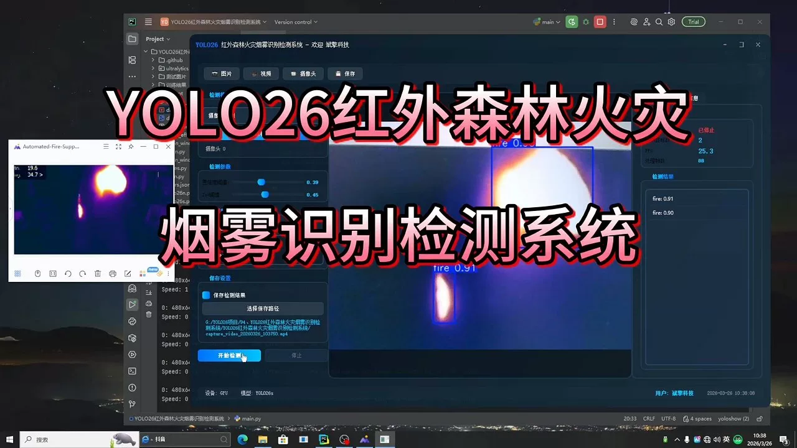
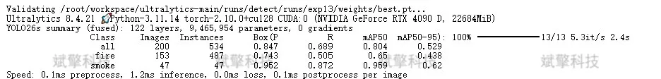
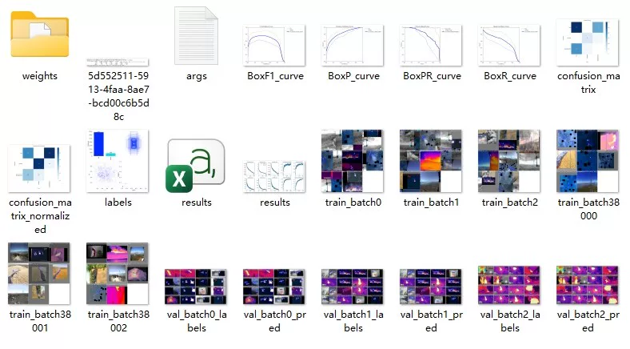
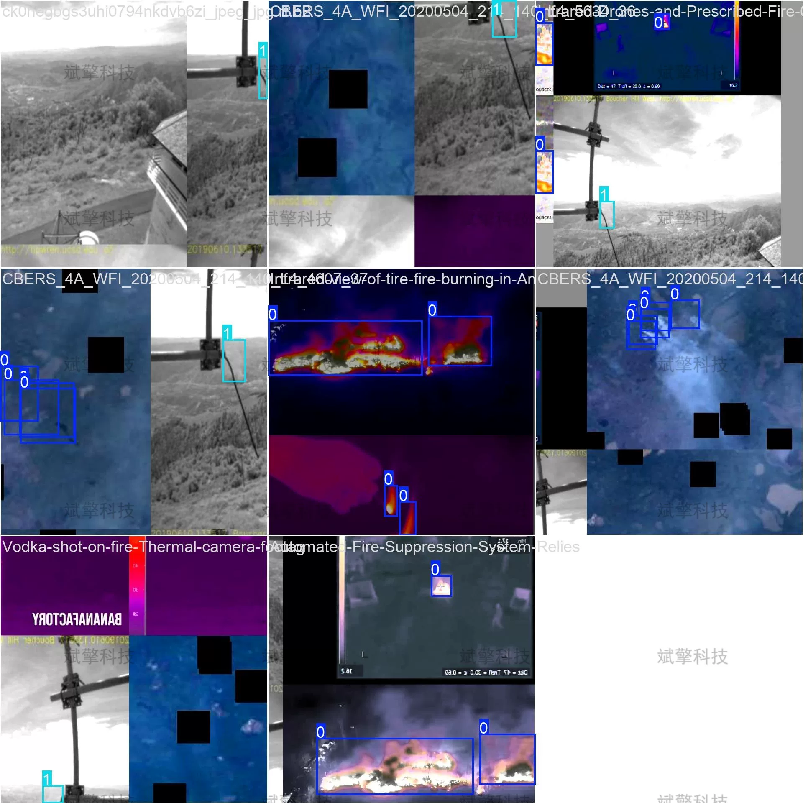
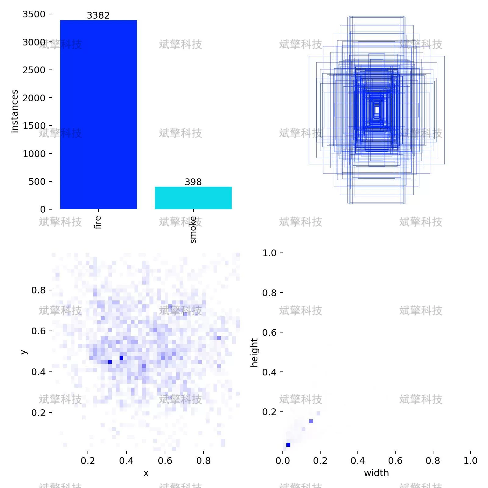
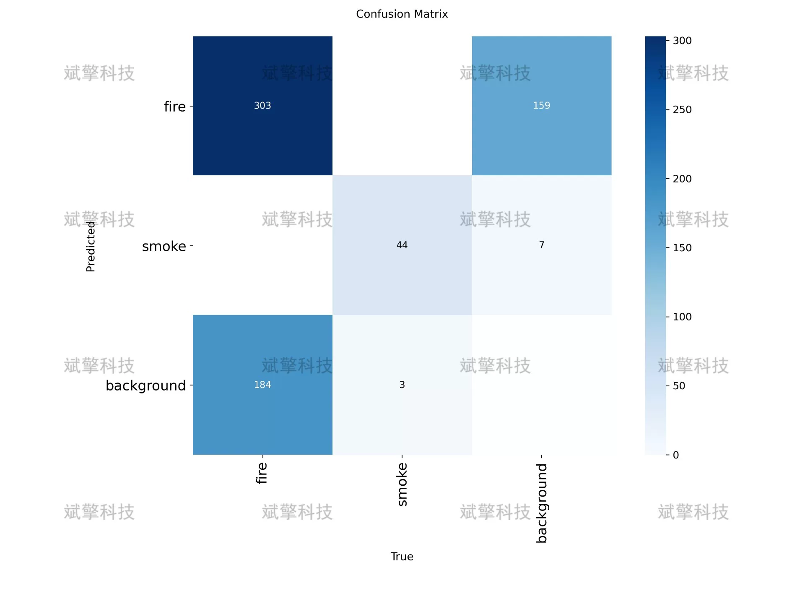
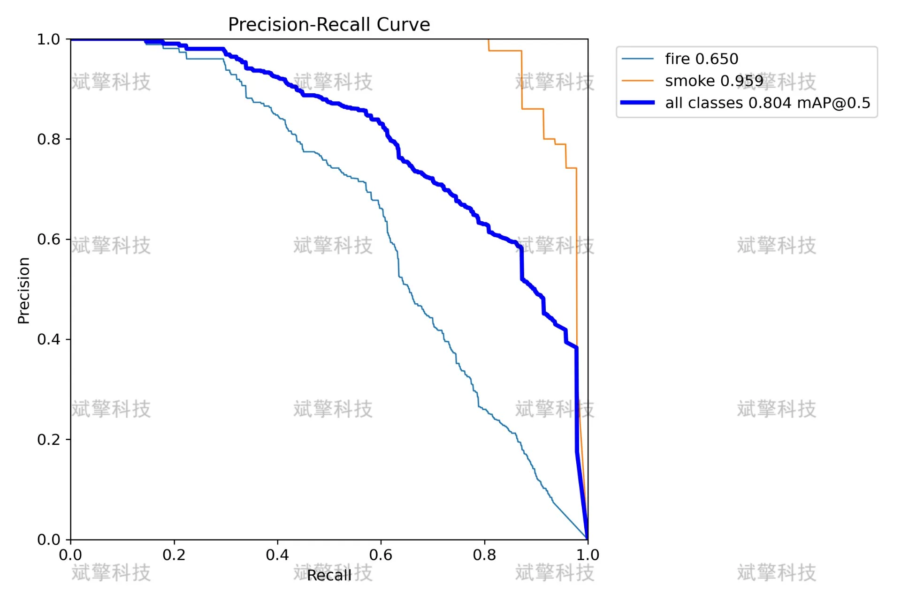
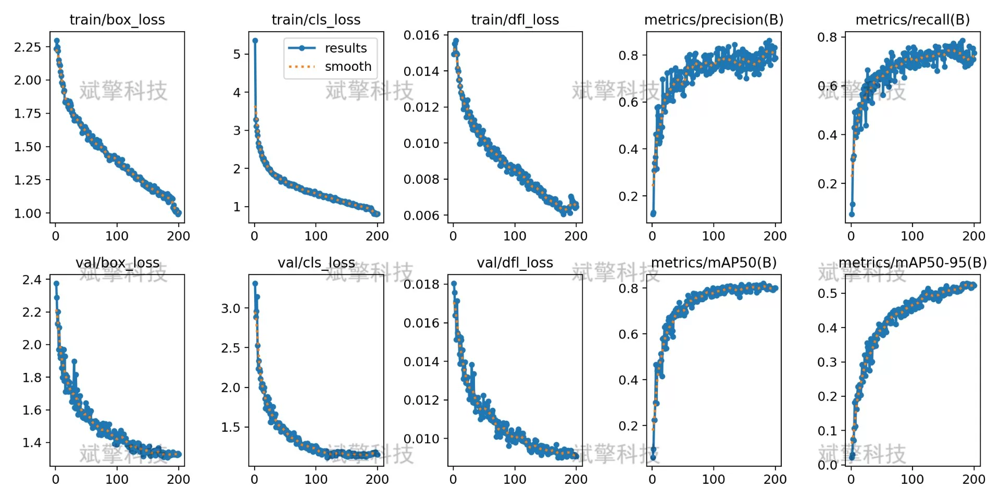
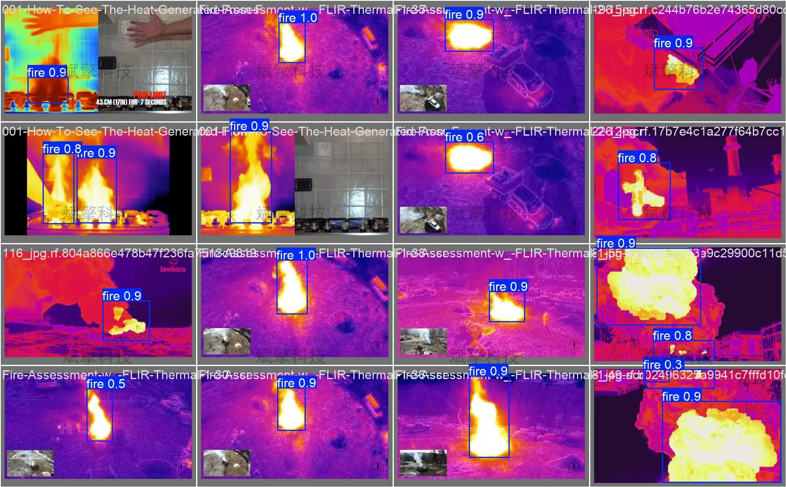

# YOLO26 Infrared Forest Fire Smoke Detection System

## Body

YOLO26 Infrared Forest Fire and Smoke Detection System: Real-World Deployment of the YOLO26 IR Forest Fire and Smoke Detection System (Project Source Code + Dataset + Model Weights + UI Interface + Python + Deep Learning + Remote Environment Deployment)

Forest fires are one of the major natural disasters that threaten ecological environment and human life and property safety. Traditional fire monitoring methods have problems such as slow response and limited coverage. This system is based on the YOLO26 object detection algorithm to build a set of infrared forest fire and smoke recognition detection systems. The system takes infrared images as input, capable of simultaneously recognizing "fire" and "smoke" targets. The experimental dataset contains 2000 infrared labeled images, including 1600 training sets, 200 validation sets, and 200 test sets. The model performs excellently in the category of smoke (mAP50=0.959), with a mAP50 for fire categories at 0.650, achieving an overall mAP50 of 0.804. The experimental results show that this system has good fire and smoke recognition capabilities in infrared scenes, providing effective technical support for forest fire prevention.
Training Set: 1600 images (80%)
Validation Set: 200 images (10%)
Test Set: 200 images (10%)

Category Explanation
fire (Fire)
smoke (Smoke)

Free reservation for remote installation. Unsuccessful full refund.
Purchase Enjoy the following resources (Automatically unlocked in Baidu Pan):
    Full source code of the YOLO recognition detection project
    YOLO format dataset
    Training code + UI interface code
    Trained model + result images
    Software install package
Add WeChat to make a reservation for remote installation (Automatically display WeChat ID after purchase) - Unsuccessful, full refund

⚙️ Core Functional Modules
Detection Capability
   Image detection: upload and detect, return detection box + category information
   Video detection: supports video files, analyzes frames accurately
   Camera real-time detection: connects USB camera, realizes dynamic monitoring
Interaction and Control
   Object selection: freely choose one or more categories for detection
   Parameter adjustment: adjustable confidence threshold & IoU threshold, flexible control precision
   Result saving: one-click save of image/video/camera detection results
System and Data
   User login registration: Support password strength detection + encryption storage
   Log recording: automatically records operation and error information (with timestamp)

## Images

## Payment

Here is a pay link on Stripe ( https://buy.stripe.com/3cs8yP7sY87d0vu9AB ). Please contact me lonlonago@foxmail.com after funding $89, and I will send you a complete data files , thank you!

